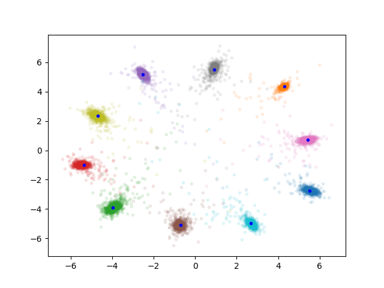
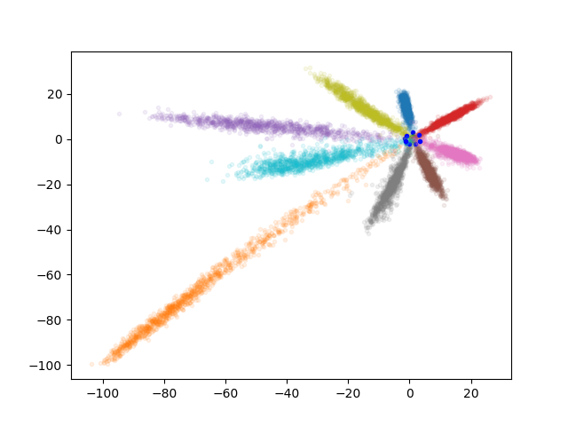

# Center Proto Loss

这个实验目的是测试两个loss在度量学习上的效果。

## Center loss

原始的 Center loss，提出于 ECCV 16 年的一遍文章中，用来做人脸验证。这个 loss 的效果和论文中一样，可以把同一类的样本聚在一起。

## Proto Center Loss

这个 loss 是我自己想出来的，利用 center loss 中的 center 代替 proto loss 中的原型。原始 proto loss 中，类别原型由每个类别 sample 的 few-shot 估计，这里每个类别的原型用一个全局的center 代替。

即样本到所有类别中心的距离，再进行softmax，表示该样本的类别预测。希望这个 loss 可以约束样本到本类别的距离更小，到其他类别的距离更大。

但是这个 loss 并无法达到这个预期，它收敛到特征空间分布如下图：

具体啥原因还不清楚。